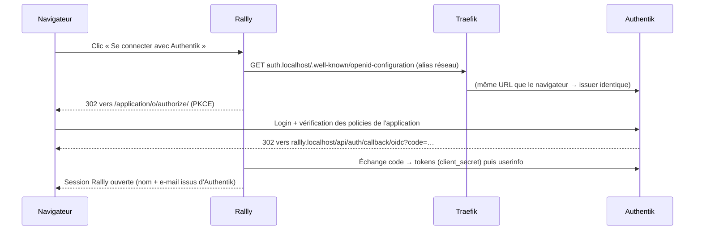

# Authentik : SSO, policies par groupe, invitation externe

Toute la configuration Authentik du projet est **déclarative**. Elle vit dans des
[blueprints](https://docs.goauthentik.io/customize/blueprints/) versionnés dans
`infra/authentik/blueprints/`, montés en lecture seule dans les conteneurs et appliqués
automatiquement par le worker au démarrage et à chaque modification.

Il n'y a aucun clic à faire pour obtenir un SSO fonctionnel après un `docker compose up`.

| Fichier | Contenu |
|---|---|
| `10-rallly-sso.yaml` | Provider OIDC, application Rallly, groupes `rallly-admins` / `rallly-users`, policies d'accès, comptes de démo |
| `20-invitation-externe.yaml` | Flux d'enrôlement sur invitation (`rallly-invitation`) |

Pour vérifier l'application : **Admin → Customization → Blueprints**. Le statut doit être `successful`.

## 1. SSO OIDC Authentik → Rallly

| Paramètre | Valeur |
|---|---|
| Type | OAuth2/OpenID Connect, client **confidential** + PKCE |
| Client ID / Secret | `RALLLY_OIDC_CLIENT_ID` / `RALLLY_OIDC_CLIENT_SECRET` (`.env`, partagé entre Authentik et Rallly) |
| Redirect URI (strict) | `${RALLLY_URL}/api/auth/callback/oidc` |
| Scopes | `openid`, `email`, `profile` |
| Discovery | `${AUTHENTIK_URL}/application/o/rallly/.well-known/openid-configuration` |
| Signature | RS256, certificat auto-signé d'Authentik |

Côté Rallly :
- `EMAIL_LOGIN_ENABLED=false` : la connexion se fait **uniquement** via Authentik. Le vote invité reste possible sur un lien de sondage.
- Les comptes Rallly sont créés à la première connexion SSO (`REGISTRATION_ENABLED=true`).

## 2. Policies par groupe

| Groupe | Droits | Compte de démo |
|---|---|---|
| `rallly-admins` | Accès à Rallly + administration (control panel Rallly) | `alice` |
| `rallly-users` | Accès à Rallly | `bob` |
| *(aucun)* | **Accès refusé** à Rallly | `charlie` |

L'application `rallly` a deux *policy bindings* de type groupe, en mode `any` : l'utilisateur doit
appartenir à l'un des deux groupes. Sinon Authentik affiche « Permission denied » et ne renvoie
jamais vers Rallly.

Les comptes de démo partagent le mot de passe `DEMO_USERS_PASSWORD` (`.env`). Ils sont créés une
seule fois : une modification faite ensuite dans l'interface n'est pas écrasée.

Pour le rôle admin dans Rallly : `RALLLY_INITIAL_ADMIN_EMAIL=alice@example.com`. Il faut se connecter
avec alice, aller sur `/control-panel` et cliquer sur « Make me an admin ». Le mapping automatique
groupe → rôle Rallly est l'objet de la feature libre du groupe.

### Scénario de démo

1. `bob` → http://rallly.localhost → « Authentik » → connecté. ✅
2. `charlie` → même parcours → *Permission denied* chez Authentik. ❌
3. Dans Authentik, ajouter `charlie` au groupe `rallly-users` → il se reconnecte → accès. ✅
4. `alice` → `/control-panel` Rallly. 🛡️

## 3. Invitation externe

Le flux `rallly-invitation` comprend les étapes suivantes :

1. **Invitation stage** : sans token valide, le flux s'arrête.
2. **Prompt** : nom d'utilisateur, nom, e-mail et mot de passe.
3. **User write** : crée un utilisateur de type **external** (`users/external`) et l'ajoute à `rallly-users`.
4. **User login** : connexion automatique.

### Démontrer une invitation

1. Se connecter en `akadmin` sur http://auth.localhost → **Admin → Directory → Invitations → New Invitation**.
2. Renseigner le **Flow** `rallly-invitation`, cocher *Single use* et choisir une expiration.
3. Dans l'étape finale, cliquer sur **Send via Email** et saisir l'adresse de l'invité.
4. Ouvrir http://mail.localhost : l'e-mail contient le lien `http://auth.localhost/if/flow/rallly-invitation/?itoken=…`.
5. L'invité crée son compte, puis ouvre Rallly → « Authentik » → accès (groupe `rallly-users`).
6. Le même lien réutilisé (single use) ou le flux ouvert sans `itoken` est refusé.

## Pièges rencontrés

- **Issuer différent entre conteneur et navigateur.** Rallly doit joindre Authentik par la même URL
  que le navigateur. D'où les alias réseau `auth.<DOMAIN>` portés par Traefik dans `compose.yml`.
- **Redirect URI stricte.** Elle doit correspondre exactement à `RALLLY_URL`, port compris si `HTTP_PORT≠80`.
- **`email_verified=false`.** C'est la valeur par défaut d'Authentik depuis 2025.10. Rallly fait
  confiance au provider `oidc` (`trustedProviders`), donc pas de blocage.
- **Ordre des blueprints.** Le groupe `rallly-users` est déclaré dans les deux fichiers pour ne pas
  dépendre de l'ordre d'application.
